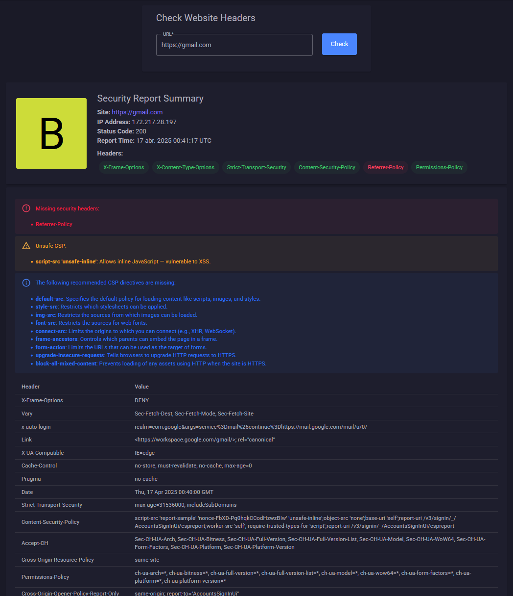

# :lock: Check Headers - Analyze Website Security Headers

Check Headers is a web-based tool that helps you quickly inspect and evaluate the HTTP security headers of any website. Simply enter a URL, and Check Headers will retrieve and analyze the site's headers, providing a comprehensive report that includes:

    ✅ Presence of essential security headers like Content-Security-Policy, Strict-Transport-Security, X-Frame-Options, and more

    🛡 A security grade from A+ to F, based on missing or misconfigured headers

    ⚠ Detection of unsafe Content-Security-Policy (CSP) configurations

    📋 A full list of received headers and their values

    ❌ Warnings for potentially risky headers like Server or X-Powered-By

    🔍 Insight into missing CSP directives with helpful explanations

Whether you're a developer, security professional, or website owner, Check Headers makes it easy to spot weaknesses and improve your site's HTTP header security.

---

